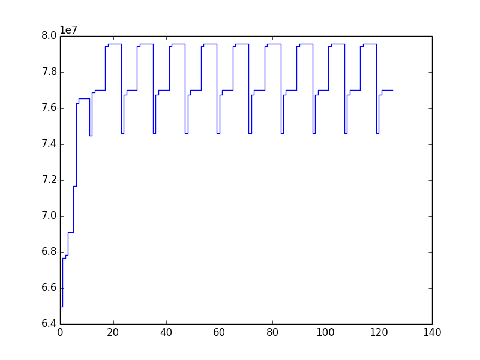

Usage
=====

The main component in the pikos toolset is the `Monitor`. A monitor creates
a number of records during the execution of the code which are passed on the
recorder to be stored into memory or file.

In code
-------

Monitors can be used programmatically in a number of ways.

#. Enabled/Disabled using the corresponding functions::

    from pikos.api import screen
    from pikos.monitors.api import FunctionMonitor

    monitor = Monitor(recorder=screen())
    monitor.enable()

    # monitored code
    #

    monitor.disable()

#. A monitor instance can be used as a context manager::

    from pikos.api import screen
    from pikos.monitors.api import FunctionMonitor

    monitor = Monitor(recorder=screen())

    with monitor:
        # monitored code
        #
        pass

#. With the use of the `attach` method a monitor becomes a decorator::

    from pikos.api import screen
    from pikos.monitors.api import FunctionMonitor

    monitor = Monitor(recorder=screen())

    @monitor.attach
    def monitored_function():
        # monitored code
        #
        pass

#. Finally the :mod:`pikos.api` module provides easy to use decorator
   factories for the standard monitors. The factories can optionally accept
   a recorder and dictate if a focused monitor should be used::

    from pikos.api import function_monitor, csv_file

    @function_monitor(recorder=csv_file(), focused=True)
    def monitored_function():
        # monitored code
        #
        pass

Command line
------------

The standard pikos monitors can be also used throught a command prompt tool,
`pikos-run`::

    usage: pikos-run [-h] [-o OUTPUT] [--buffered] [--recording {screen,text,csv}]
                     [--focused-on FOCUSED_ON]
                     {functions,line_memory,lines,function_memory} script

    Execute the python script inside the pikos monitor context.

    positional arguments:
      {functions,line_memory,lines,function_memory}
                            The monitor to use
      script                The script to run.

    optional arguments:
      -h, --help            show this help message and exit
      -o OUTPUT, --output OUTPUT
                            Output results to a file
      --buffered            Use a buffered stream.
      --recording {screen,text,csv}
                            Select the type of recording to use.
      --focused-on FOCUSED_ON
                            Provide the module path(s) of the method where
                            recording will be focused. Comma separated list of
                            importable functions

Example
-------

Given the code bellow:

.. literalinclude:: ../examples/mandelbrot_set_example.py

Running::

    pikos-run function_memory examples/mandelbrot_set_example.py --recording csv --focused-on=mandelbrot

from the root directory will run the `mandelbrot` example and record the
memory usage on function entry and exit while inside the `mandelbrot` method.
The monitoring information will be recorded in csv format in the
`monitor_records.csv` (default filename).

CSV Sample
~~~~~~~~~~

::

    index,function,lineNo,RSS,VMS,line,filename
    0,mandelbrot,16,64679936,382787584,"    y,x = ogrid[-1.4:1.4:h*1j, -2:0.8:w*1j]",examples/mandelbrot_set_example.py
    1,mandelbrot,17,64962560,383229952,    c = x+y*1j,examples/mandelbrot_set_example.py
    2,mandelbrot,18,67678208,386056192,    z = c,examples/mandelbrot_set_example.py
    3,mandelbrot,19,67817472,386056192,"    divtime = maxit + zeros(z.shape, dtype=int)",examples/mandelbrot_set_example.py
    4,mandelbrot,21,69103616,387338240,    for i in xrange(maxit):,examples/mandelbrot_set_example.py
    5,mandelbrot,22,69103616,387338240,       z = z**2 + c,examples/mandelbrot_set_example.py
    6,mandelbrot,23,71671808,389902336,       diverge = z*conj(z) > 2**2            # who is diverging,examples/mandelbrot_set_example.py
    7,mandelbrot,24,76263424,394760192,       div_now = diverge & (divtime==maxit)  # who is diverging now,examples/mandelbrot_set_example.py
    8,mandelbrot,25,76529664,394760192,       divtime[div_now] = i                  # note when,examples/mandelbrot_set_example.py
    9,mandelbrot,26,76529664,394760192,       z[diverge] = 2                        # avoid diverging too much,examples/mandelbrot_set_example.py
    10,mandelbrot,21,76537856,394760192,    for i in xrange(maxit):,examples/mandelbrot_set_example.py
    11,mandelbrot,22,76537856,394760192,       z = z**2 + c,examples/mandelbrot_set_example.py
    12,mandelbrot,23,74452992,392675328,       diverge = z*conj(z) > 2**2            # who is diverging,examples/mandelbrot_set_example.py
    13,mandelbrot,24,76881920,395235328,       div_now = diverge & (divtime==maxit)  # who is diverging now,examples/mandelbrot_set_example.py
    14,mandelbrot,25,77012992,395235328,       divtime[div_now] = i                  # note when,examples/mandelbrot_set_example.py
    15,mandelbrot,26,77012992,395235328,       z[diverge] = 2                        # avoid diverging too much,examples/mandelbrot_set_example.py
    16,mandelbrot,21,77012992,395235328,    for i in xrange(maxit):,examples/mandelbrot_set_example.py
    17,mandelbrot,22,77012992,395235328,       z = z**2 + c,examples/mandelbrot_set_example.py
    18,mandelbrot,23,79441920,397795328,       diverge = z*conj(z) > 2**2            # who is diverging,examples/mandelbrot_set_example.py
    19,mandelbrot,24,79572992,397795328,       div_now = diverge & (divtime==maxit)  # who is diverging now,examples/mandelbrot_set_example.py

The first column is the record index, followed by the function name and the
line number where (just before execution) the RSS, VMS memory counters for the
python process are recorded. The last two column contains the python line
of the function.

.. note::

    This record type is specific to the
    :class:`~pikos.monitors.line_memory_monitor.LineMemoryMonitor`.

Plot Data
~~~~~~~~~

loading the csv file into ipython we can plot the graph of record index to RSS
memory usage of the python process while executing the `mandelbrot` function::

    In [1]: import numpy

    In [2]: import pylab

    In [3]: data = numpy.loadtxt('monitor_records.csv',usecols=[0, 3], delimiter=',', skiprows=1)

    In [4]: pylab.plot(data[:, 0], data[:, 1], drawstyle='steps')

    In [5]: pylab.show()

    The plot of record index vs RSS memory usage (in bytes) of the python
    process when running the `mandelbrot` function.
